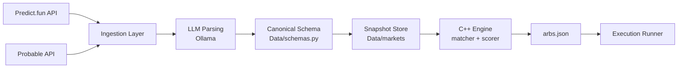
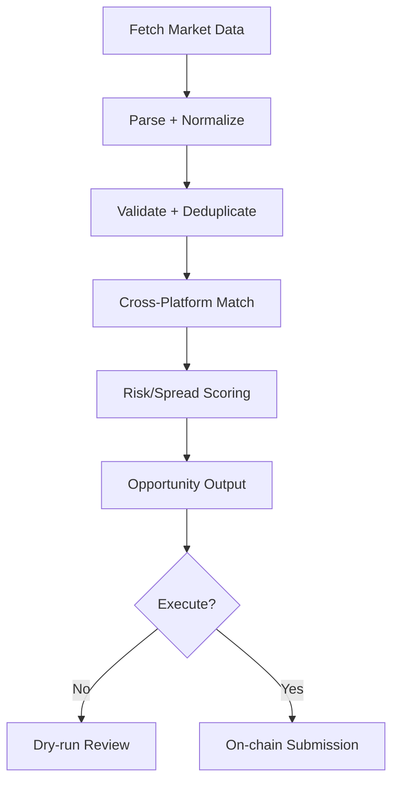

# arb-agent

Fast, modular arbitrage stack for prediction markets across platforms like Predict.fun and Probable.

## Why this project exists

Prediction market payloads are effectively **unregulated at the data-shape level**: field names, market wording, resolution rules, and metadata quality vary across sources and often drift over time.

That inconsistency breaks strict parsers and creates bad matches. This project uses **LLM-assisted parsing + normalization** to convert messy upstream payloads into a single internal schema that the C++ matcher can safely consume.

## Core pipeline

1. Ingest raw markets from multiple APIs.
2. Use local Ollama models to parse and normalize inconsistent text/metadata.
3. Persist normalized snapshots.
4. Run low-latency C++ matching/scoring in memory.
5. Export opportunities and optionally execute on-chain.

## Flow diagrams

### Data normalization and matching flow



### Lifecycle flow



## Tech stack

- Python ingestion and orchestration
- Ollama for local LLM parsing
- C++14 matching engine for low-latency scanning
- Optional Solidity/Hardhat execution contract path

## Repository layout

- `Ingestion/` - source adapters + parsing pipeline
- `Data/schemas.py` - normalized data contracts
- `Data/markets/` - generated normalized snapshots
- `Engine/` - C++ matcher/scorer and build system
- `Execution/` - dry-run/live opportunity executor
- `Contracts/` - `ArbExecutor.sol` and deployment tooling
- `docs/` - setup, build, troubleshooting, API key notes

## Quick start

### 1) Prerequisites

- Python 3.11+
- CMake 3.5+
- C++ compiler (MinGW/GCC/MSVC)
- Ollama running locally at `http://localhost:11434`
- Node.js 18+ (only for contract deployment)

### 2) Install

```bash
pip install -r requirements.txt
```

### 3) Configure env

Create `.env` and set at minimum:

```dotenv
LLM_PROVIDER=ollama
MODEL=
OLLAMA_BASE_URL=http://localhost:11434
PREDICTFUN_API_KEY=your_key_here
```

### 4) Ingest

```bash
python -m Ingestion.ingest_predictfun
python -m Ingestion.ingest_probable
```

### 5) Build + run engine

```bash
cd Engine
cmake -S . -B build
cmake --build build
./build/arb-engine.exe --output arbs.json   # Windows
./build/arb-engine --output arbs.json       # Linux/macOS
```

### 6) Review or execute

```bash
python -m Execution.run_arb --arbs Engine/build/arbs.json
python -m Execution.run_arb --arbs Engine/build/arbs.json --execute
```

## Notes

- ZMQ is optional; snapshot mode works without it.
- Generated snapshots/build outputs are not tracked by git.
- Live execution is opt-in via `--execute`.

## Docs

- `SETUP_AND_RUN.md`
- `docs/BUILD_ENGINE.md`
- `docs/API_KEYS.md`
- `docs/TROUBLESHOOTING.md`

## License

MIT — see `LICENSE`.
